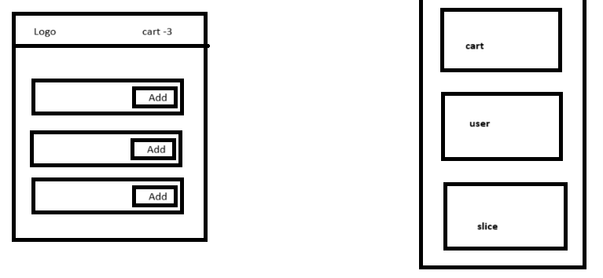
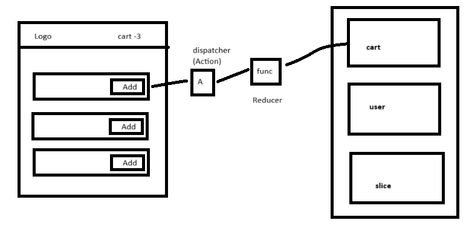
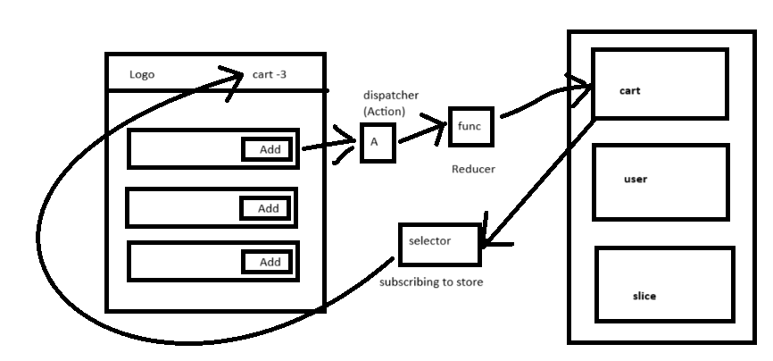
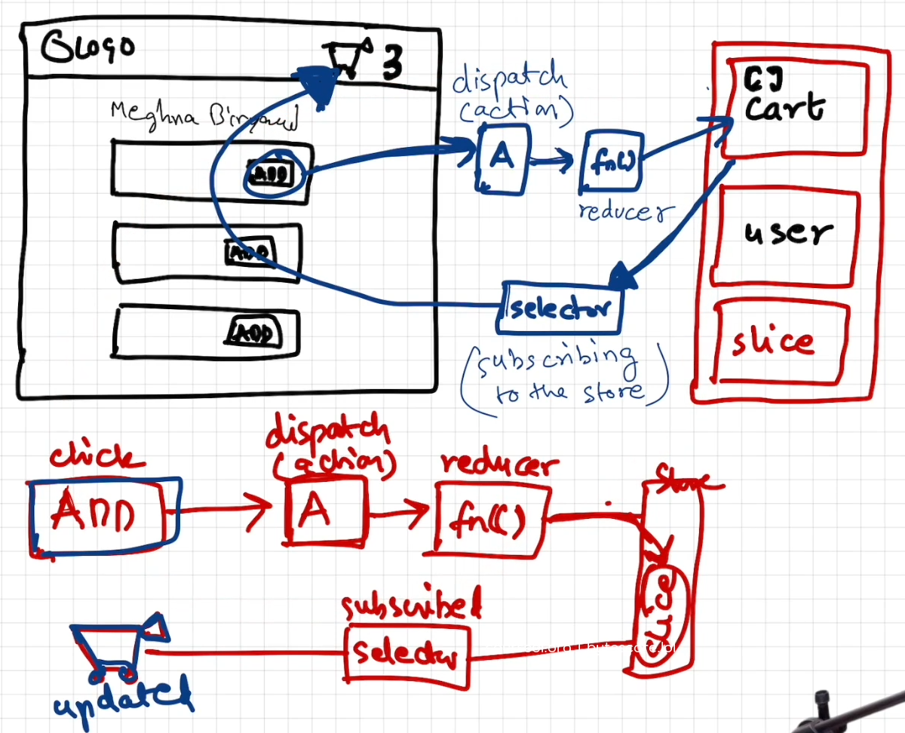

# Redux store is a big object is kept in global central place
- we have parts of redux store known as slice
  * A cart data is a slice
  * logged in user info is a slice
  * theme related dark mode
 
  
 - suppose if we click on add button it dispatches an  action
 - it calls an function 
 - and this func is modifies the cart 

 * What is this function?
   - This function known as reducer

 * when we click on add button it dispatches an action and calls reducer function which updates the slice of redux store

 

 uptoo now we write the data
 now we read the data

 - for that we use selector to read data from store and it modifies the react element 

 -  Header component is suscribing(sync) to the store using selector
  - Any modification in the store will update the header

  
  

# Redux Toolkit
  - Install @reduxjs/toolkit and react-redux
  - Build our store
  - connect our store to app
  - create slice (cartSlice)
  - dispatch(action)
  - selector 